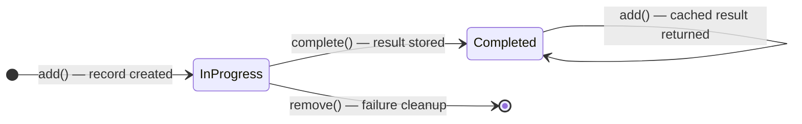

<div align="center">

[](https://opensource.org/licenses/ISC)
[](https://www.typescriptlang.org/)
[](https://nodejs.org/)
[](https://aws.amazon.com/dynamodb/)

# Idempotency

**Lightweight TypeScript library for idempotent execution with pluggable persistence backends.**

</div>

<details>
<summary>Table of Contents</summary>

- [Features](#features)
- [How It Works](#how-it-works)
- [Installation](#installation)
- [Quick Start](#quick-start)
- [Usage Patterns](#usage-patterns)
- [API Reference](#api-reference)
- [Persistence Backends](#persistence-backends)
- [Local Development Setup](#local-development-setup)
- [Built With](#built-with)
- [Contributing](#contributing)
- [License](#license)
- [Author](#author)

</details>

---

## Features

- **Pluggable persistence** — ships with DynamoDB and In-Memory backends; implement the `Persistence` interface for any storage engine.
- **Concurrency protection** — conditional writes prevent two concurrent callers from running the same use case simultaneously.
- **TTL-based auto-expiration** — records expire automatically; no manual cleanup needed for old entries.
- **Custom hash calculator** — control exactly which fields of your input contribute to the idempotency key (handy for excluding volatile fields like `createdAt`).
- **Typed error hierarchy** — every failure mode has a distinct error class so callers can handle each case precisely.
- **Automatic cleanup on failure** — calling `remove()` after a failed execution deletes the in-progress record, making safe retries trivial.

---

## How It Works

Each execution is tracked as a record keyed by `(useCaseName, idempotencyKey)` and progresses through three states:



| Situation | `add()` returns | Action |
|---|---|---|
| No existing record | `undefined` | Run the use case, then call `complete()` |
| Record is `completed` | Cached `resultData` | Skip the use case — return cached result |
| Record is `in progress` | *(throws)* | `UseCaseAlreadyInProgressError` — return 409 |

---

## Installation

```bash
npm install idempotency
```

`@aws-sdk/client-dynamodb` is required as a peer dependency when using `DynamoDBPersistence`:

```bash
npm install @aws-sdk/client-dynamodb
```

---

## Quick Start

```typescript
import { DynamoDBClient } from '@aws-sdk/client-dynamodb';
import { DynamoDBPersistence } from './src/DynamoDBPersistence';
import { Config, Idempotency, md5 } from './src/Idempotency';
import { IdempotencyError } from './src/Errors';

type Input = { name: string; age: number; createdAt: Date };
type Result = { id: number; name: string; age: number };

// Exclude volatile fields (createdAt) — same logical request always maps to the same hash
const config: Config = {
    ttl: 60,
    customHashCalculator: (input: Input) =>
        md5(JSON.stringify({ name: input.name, age: input.age })),
};

const idempotency = new Idempotency(
    new DynamoDBPersistence(
        new DynamoDBClient({ region: 'us-east-1' }),
        { ttl: config.ttl, tableName: 'idempotency' }
    ),
    config
);

/**
 * Reusable execute() wrapper:
 *  - Returns a cached result when the same input was successfully completed before.
 *  - Cleans up on failure so the caller can safely retry.
 *  - Throws UseCaseAlreadyInProgressError on concurrent detection (map to HTTP 409).
 */
async function execute<T>(
    useCase: string,
    input: Input,
    fn: (i: Input) => T
): Promise<T> {
    let result: T | undefined;

    try {
        result = await idempotency.add<T>(useCase, input);

        if (result === undefined) {
            result = fn(input);
            await idempotency.complete(useCase, input, result);
        }

        return result as T;
    } catch (e) {
        if (!IdempotencyError.isAlreadyInProgressError(e)) {
            // Use case failed — remove the in-progress record so retries start fresh
            await idempotency.remove(useCase, input);
        }
        throw e;
    }
}
```

---

## Usage Patterns

### New execution

`add()` finds no record → use case runs → result is stored.

```typescript
const result = await execute('create-order', input, createOrder);
// createOrder() is called; result saved to persistence
```

### Idempotent retry (success)

Same logical input (even with a different `createdAt`) → `add()` returns the cached result → use case is **not** executed again.

```typescript
const retryInput = { ...input, createdAt: new Date() }; // new timestamp, same hash
const result = await execute('create-order', retryInput, createOrder);
// createOrder() is NOT called; cached result returned from persistence
```

### Concurrent execution

A second caller detects `in progress` and `add()` throws `UseCaseAlreadyInProgressError`.

```typescript
import { IdempotencyError } from './src/Errors';

try {
    await execute('create-order', input, createOrder);
} catch (e) {
    if (IdempotencyError.isAlreadyInProgressError(e)) {
        // Return HTTP 409 Conflict — another instance is already processing this request
    }
}
```

### Failure with cleanup

The use case throws → `remove()` deletes the in-progress record → next call retries from scratch.

```typescript
try {
    await execute('create-order', input, createOrder); // createOrder() throws
} catch (e) {
    // Idempotency record removed by execute() — safe to retry
}

// Subsequent call: no stale record, fresh execution
const result = await execute('create-order', input, createOrder);
```

---

## API Reference

### `Idempotency`

```typescript
new Idempotency(persistence: Persistence, config: Config)
```

| Method | Signature | Description |
|---|---|---|
| `add` | `add<T>(useCase: string, input: any): Promise<T \| undefined>` | Registers a new execution. Returns `undefined` (no prior record) or cached `T` (prior completed record), or throws on concurrency. |
| `complete` | `complete(useCase: string, input: any, result: any): Promise<void>` | Marks the execution as completed and stores the result. |
| `remove` | `remove(useCase: string, input: any): Promise<void>` | Deletes the idempotency record so retries start fresh. |

### `Config`

```typescript
type Config = {
    ttl: number;                                    // Record lifetime in seconds
    customHashCalculator?: (input: any) => string;  // Override the default MD5 hash
}
```

### `Persistence` interface

Implement this to add your own storage backend:

```typescript
interface Persistence {
    add(useCase: string, key: string, status: IdempotencyStatus): Promise<boolean>;
    update(useCase: string, key: string, status: IdempotencyStatus, data: any): Promise<void>;
    delete(useCase: string, key: string): Promise<void>;
    get(useCase: string, key: string): Promise<PersistenceRecord>;
}
```

### Error hierarchy

| Class | Code | When thrown |
|---|---|---|
| `UseCaseAlreadyInProgressError` | `UseCaseAlreadyInProgress` | A concurrent execution is in progress |
| `UnknownUseCaseError` | `IdempotencyKeyNotFound` | Record not found when expected |
| `UnableToRemoveIdempotencyKeyError` | `IdempotencyKeyNotFound` | Record missing during `update()` |
| `PeristenceError` | `PeristenceError` | Underlying persistence failure |

**Helper:** `IdempotencyError.isAlreadyInProgressError(error)` — returns `true` for `UseCaseAlreadyInProgressError` regardless of how the error crossed a process boundary.

---

## Persistence Backends

### DynamoDB

Recommended for production. Uses conditional writes for atomic concurrency protection.

#### Table schema

| Attribute | Type | Description |
|---|---|---|
| `PK` | String (Partition Key) | Use case name |
| `SK` | String (Sort Key) | Idempotency key (MD5 hash of input) |
| `status` | String | `in progress` or `completed` |
| `resultData` | String | JSON-serialised execution result |
| `expiration` | Number | Unix timestamp (ms) — DynamoDB TTL attribute |
| `createdAt` | String | ISO 8601 timestamp |

The `add()` operation uses a conditional expression that succeeds only when no record exists **or** the existing record has expired:

```
(attribute_not_exists(PK) AND attribute_not_exists(SK))
OR (attribute_exists(PK) AND attribute_exists(SK) AND expiration < :now)
```

A `ConditionalCheckFailedException` from DynamoDB means the record exists and is still active — `add()` returns `false` and `Idempotency` determines whether it is `completed` or `in progress`.

#### Configuration

```typescript
import { DynamoDBClient } from '@aws-sdk/client-dynamodb';
import { DynamoDBPersistence } from './src/DynamoDBPersistence';

const persistence = new DynamoDBPersistence(
    new DynamoDBClient({ region: 'us-east-1' }),
    { ttl: 60, tableName: 'idempotency' }
);
```

### In-Memory

Intended for **testing and local development only** — state is not shared across processes and is lost on restart.

```typescript
import { InMemoryPersistence } from './src/InMemoryPersistence';

const persistence = new InMemoryPersistence(60 /* ttl in seconds */);
```

### Custom Persistence

Implement the `Persistence` interface to use any storage engine (Redis, PostgreSQL, etc.):

```typescript
import { Persistence, IdempotencyStatus, PersistenceRecord } from './src/Idempotency';

class RedisPersistence implements Persistence {
    async add(useCase: string, key: string, status: IdempotencyStatus): Promise<boolean> { /* ... */ }
    async update(useCase: string, key: string, status: IdempotencyStatus, data: any): Promise<void> { /* ... */ }
    async delete(useCase: string, key: string): Promise<void> { /* ... */ }
    async get(useCase: string, key: string): Promise<PersistenceRecord> { /* ... */ }
}
```

---

## Local Development Setup

**Prerequisites:** Node.js 16+, Docker

1. Start the local DynamoDB instance:
   ```bash
   docker-compose up
   ```

2. Create the idempotency table:
   ```bash
   npm run setup
   ```

3. Run the demo scenarios (success + idempotent retry, failure + cleanup):
   ```bash
   npm run execute
   ```

4. Run the test suite:
   ```bash
   npm test
   ```

---

## Built With

- [TypeScript](https://www.typescriptlang.org/) — static typing throughout
- [AWS SDK v3](https://github.com/aws/aws-sdk-js-v3) — `@aws-sdk/client-dynamodb`
- [Amazon DynamoDB](https://aws.amazon.com/dynamodb/) — default production backend
- [Jest](https://jestjs.io/) — test runner

---

## Contributing

Contributions are welcome!

1. Fork the repository
2. Create a feature branch (`git checkout -b feature/my-feature`)
3. Commit your changes
4. Push to the branch and open a Pull Request

---

## License

Distributed under the ISC License.

[](https://opensource.org/licenses/ISC)

---

## Author

**Mario Bittencourt**

GitHub: [bicatu/idempotency](https://github.com/bicatu/idempotency)
